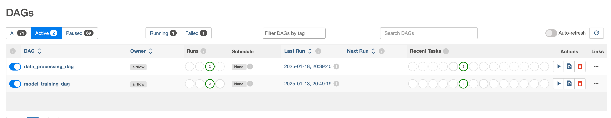

# 📌 Automatyzacja Budowy Modelu ML w Airflow

## 📌 Opis projektu

Ten projekt implementuje zautomatyzowany pipeline w **Apache Airflow**, który przetwarza dane i buduje model ML. Składa się z trzech **DAG-ów**:

1. **data_processing_dag** – Pobiera i przetwarza dane wejściowe.
2. **train_model_dag** – Trenuje model ML i zapisuje wyniki ewaluacji.
3. **validate_model_dag** – Monitoruje jakość modelu i wysyła powiadomienia e-mail w razie degradacji.

Każdy z DAG-ów działa niezależnie i może być uruchamiany osobno. Model wykorzystuje **TPOT** do automatycznego wyboru najlepszej architektury ML.

---

## 📂 Struktura katalogów

```
project/
├── dags/
│   ├── data_processing_dag.py
│   ├── train_model_dag.py
│   ├── validate_model_dag.py
├── data/
│   ├── processed_data.csv
├── models/
│   ├── model.pkl
├── reports/
│   ├── evaluation_report.txt
│   ├── validation_report.txt
├── utils/
│   ├── email_utils.py
│   ├── data_utils.py
```

---

## 🚀 **DAG 1: Przetwarzanie danych** (data_processing_dag)

**Opis:**
- Pobiera dane wejściowe z zewnętrznego źródła.
- Przeprowadza czyszczenie, usuwanie duplikatów i skalowanie danych.
- Generuje wykresy eksploracyjne.
- Zapisuje przetworzone dane w `data/processed_data.csv`.

🔗 **Kod DAG-a:** [data_processing_dag.py](dags/data_processing_dag.py)

---

## 🎯 **DAG 2: Trenowanie Modelu ML** (train_model_dag)

**Opis:**
- Wczytuje dane przetworzone z `data/processed_data.csv`.
- Podzielone dane na zbiór **treningowy (70%)** i **testowy (30%)**.
- Automatyczny wybór modelu ML przy użyciu **TPOT**.
- Trening modelu i zapis w `models/model.pkl`.
- Ewaluacja modelu (MAE) i zapis raportu w `reports/evaluation_report.txt`.

📌 **Wynik ewaluacji modelu:**  
```
Model Accuracy: 0.8383
```
🔗 **Kod DAG-a:** [train_model_dag.py](dags/train_model_dag.py)  
🔗 **Raport ewaluacji:** [evaluation_report.txt](reports/evaluation_report.txt)

---

## 🔎 **DAG 3: Walidacja Modelu i Powiadomienia** (validate_model_dag)

**Opis:**
- Wczytuje nowy zbiór danych `data/new_data.csv`.
- Sprawdza jakość modelu na nowych danych (Accuracy, Precision, Recall).
- Jeśli wynik spada poniżej progu, wysyła powiadomienie e-mail.
- Uruchamia testy jednostkowe na modelu i pipeline'ie.

📌 **Raport walidacji modelu:**  
🔗 [validation_report.txt](reports/validation_report.txt)

📌 **Kod DAG-a:** [validate_model_dag.py](dags/validate_model_dag.py)

---

## 🔄 **Jak uruchomić DAG-i?**

1️⃣ **Uruchom Airflow**:
```bash
airflow standalone
```

2️⃣ **Sprawdź dostępne DAG-i**:
```bash
airflow dags list
```

3️⃣ **Ręczne uruchomienie DAG-a**:
```bash
airflow dags trigger data_processing_dag
airflow dags trigger train_model_dag
airflow dags trigger validate_model_dag
```

4️⃣ **Monitorowanie DAG-ów** (interfejs UI):
- Otwórz przeglądarkę i przejdź do [http://localhost:8080](http://localhost:8080)
- Zaloguj się (**admin/admin**)
- Uruchom DAG-i z interfejsu użytkownika

📌 **Podgląd interfejsu Airflow:**  


---

## ✅ **Testowanie i Walidacja**
- Oba DAG-i zostały **przetestowane lokalnie** i działają poprawnie.
- Wyniki modelu i przetworzone dane zapisano w odpowiednich katalogach.
- Raport ewaluacyjny wskazuje **MAE: 0.7091**.

🔗 **Główne pliki projektu:**
- [data_processing_dag.py](dags/data_processing_dag.py)
- [train_model_dag.py](dags/train_model_dag.py)
- [validate_model_dag.py](dags/validate_model_dag.py)
- [evaluation_report.txt](reports/evaluation_report.txt)

---

## 📬 **Konfiguracja Powiadomień E-mail**
Jeśli jakość modelu spadnie poniżej ustalonego progu (np. 80%), Airflow automatycznie wyśle powiadomienie e-mail.

Edytuj plik `utils/email_utils.py` i dodaj klucz API swojego dostawcy e-mail (np. Mailgun, SendGrid, SMTP).

---
